# TOWARDS BUILDING A GROUP-BASED UNSUPERVISED REPRESENTATION DISENTANGLEMENT FRAMEWORK
<a href="https://arxiv.org/abs/2102.10303"></a>
<a href="https://opensource.org/licenses/MIT"></a>

> **TOWARDS BUILDING A GROUP-BASED UNSUPERVISED REPRESENTATION DISENTANGLEMENT FRAMEWORK** <br>
> Tao Yang, Xuanchi Ren, Yuwang Wang, Wenjun Zeng, Nanning Zheng <br>
> *arXiv preprint arXiv:2102.10303*<br>
> *ICLR 2022*<br>

[[Paper](https://openreview.net/pdf?id=YgPqNctmyd)]
[[Arxiv](https://arxiv.org/abs/2102.10543)]
[[Appendix](https://xuanchiren.com/pub/DisCo_appendix.pdf)]

## Update:

:black_square_button: Release code

## Discription:
In this repo, built on the group-based definition and inspired by the n-th dihedral group, we first propose a theoretical framework towards achieving unsupervised
representation disentanglement. We then propose a model, based on existing VAEbased methods, to tackle the unsupervised learning problem of the framework.The overview of our method is as follows:

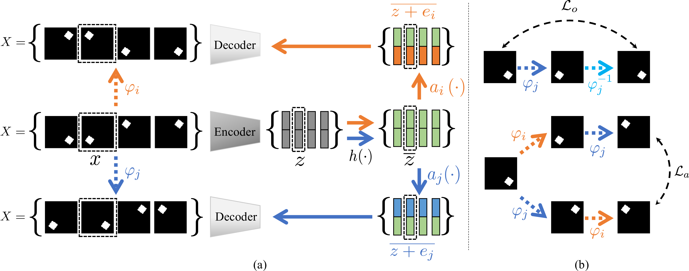


## Implementation details
- The **Isomorphism Loss** in our paper is implemented in "model/share.py"
- The **model constraint** in our paper  is implemented in the function "forward" in "model/XXX_VAE.py"

# Requirements
- build a docker environment by using "./dockerfile"

## Models
The VAE-based models: 

- [$\beta$-VAE](https://openreview.net/pdf?id=Sy2fzU9gl)
- [AnnealVAE](https://arxiv.org/pdf/1804.03599.pdf)
- [FactorVAE](https://arxiv.org/pdf/1802.05983.pdf)
- [$\beta$-TCVAE](https://arxiv.org/pdf/1802.04942.pdf)
## Datasets
The evaluation datasets:

- [dSprites](https://github.com/deepmind/dsprites-dataset)
- [Shapes3D](https://github.com/deepmind/3d-shapes)
- [Car3D](http://www.imagenet.stanford.edu/challenges/LSVRC/2012/nonpub-downloads)
- [noisy dSprites](https://github.com/deepmind/dsprites-dataset)
- [color dSprites](https://github.com/deepmind/dsprites-dataset)

Download them to "./dataset_folder/"

# Usage
The Arguements

    usage: main.py [-h] --config_num CONFIG_NUM [--eval]

    optional arguments:
    -h, --help            show this help message and exit
    --config_num CONFIG_NUM
                            the number of settings of hyperparameters and random
                            seeds
    --eval                eval model or not (default: False)


# Config File
The hyperparamter and random seed settings are numbered in './config.csv'. Every row in './config.csv' correspond to a setting.

# Examples:
## Training
Train the model under the 1000th setting:
```bash
python main.py --config_num = 1000
 ```
## Evaluation

Evaluate the model we trained above:
```bash
python main.py --config_num = 1000 --eval
```
## Qualitative evaluation
| dSprites| |
| :---: | :---: |
| BetaVAE | DCI |
| 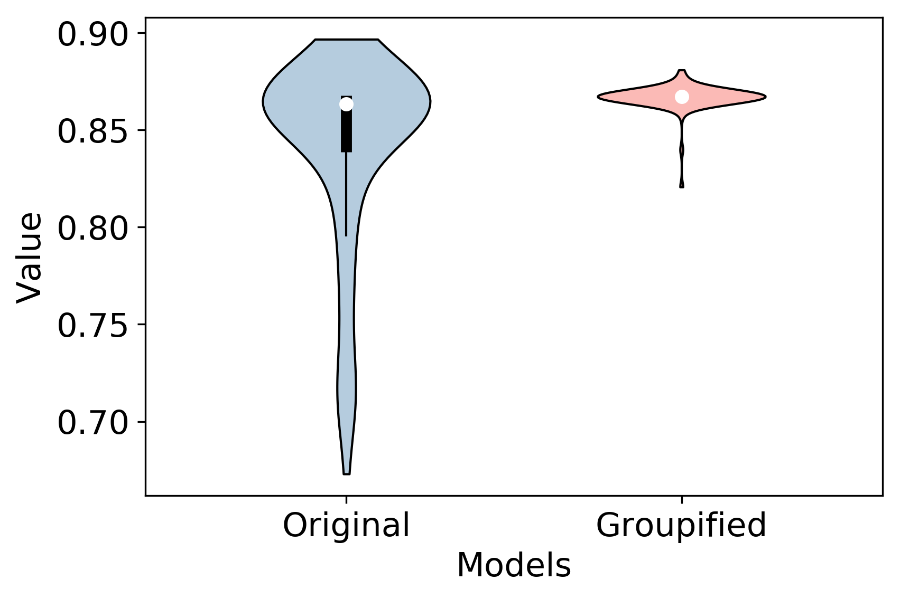 | 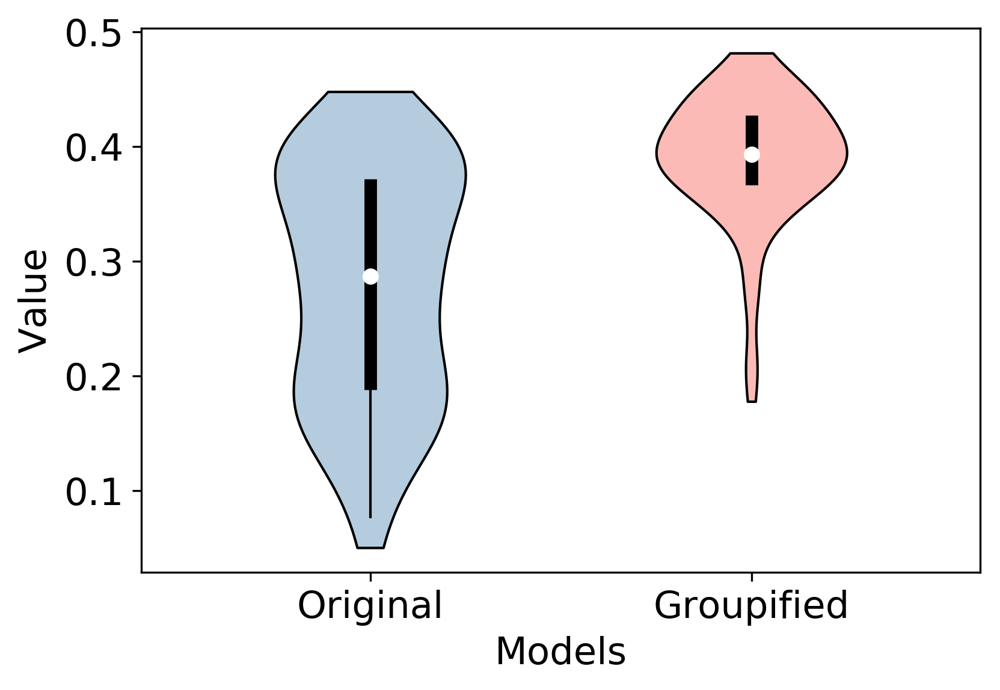 |
| MIG | FactorVAE |
| 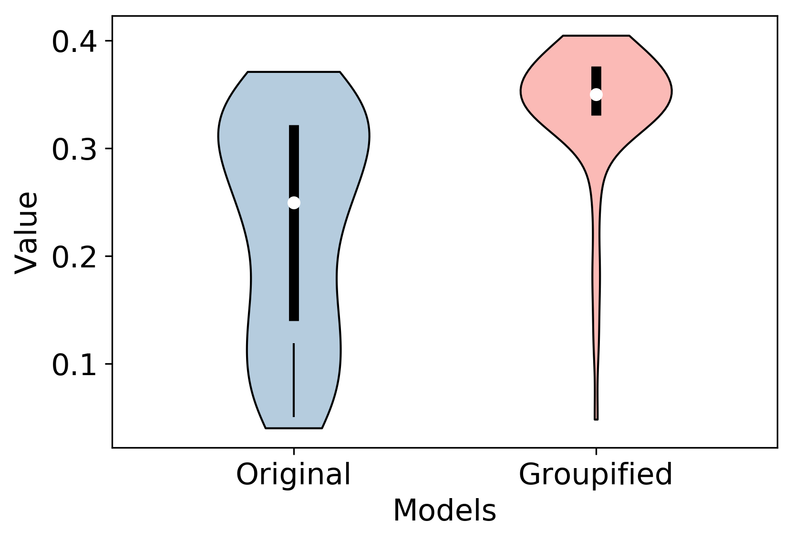 | 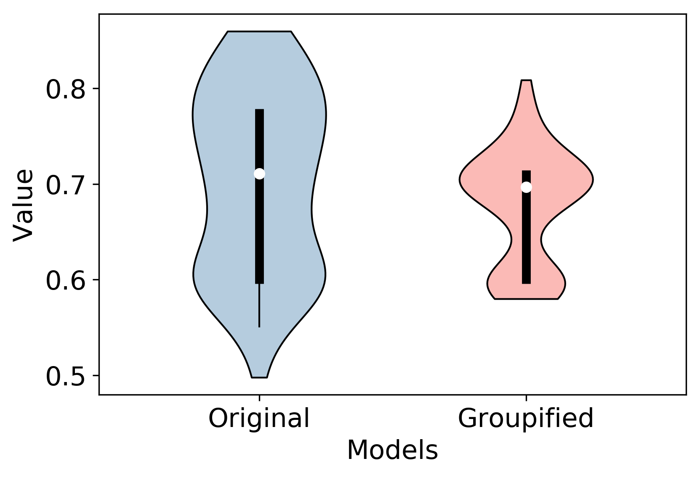 |

**NOTE:** Groupified VAE achieves better performance mean with lower variance.

## Latent space visualization
| dSprites AnnealVAE|  |
| :---: | :---: |
| C_max = 10, Original | C_max = 20, Original|
| 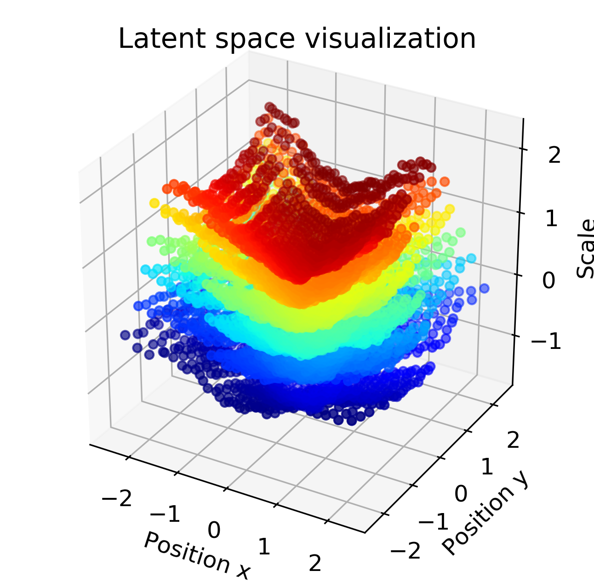 | 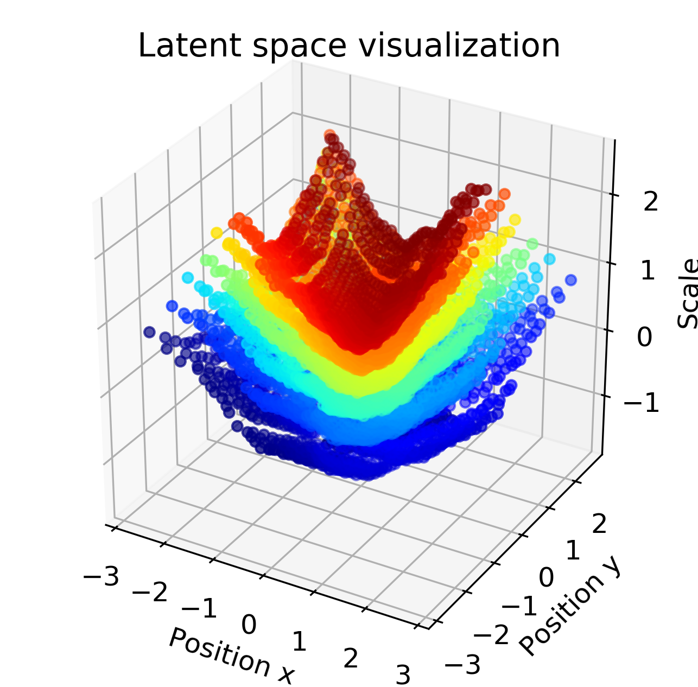 |
| C_max = 10, Groupified | C_max = 20, Groupified |
| 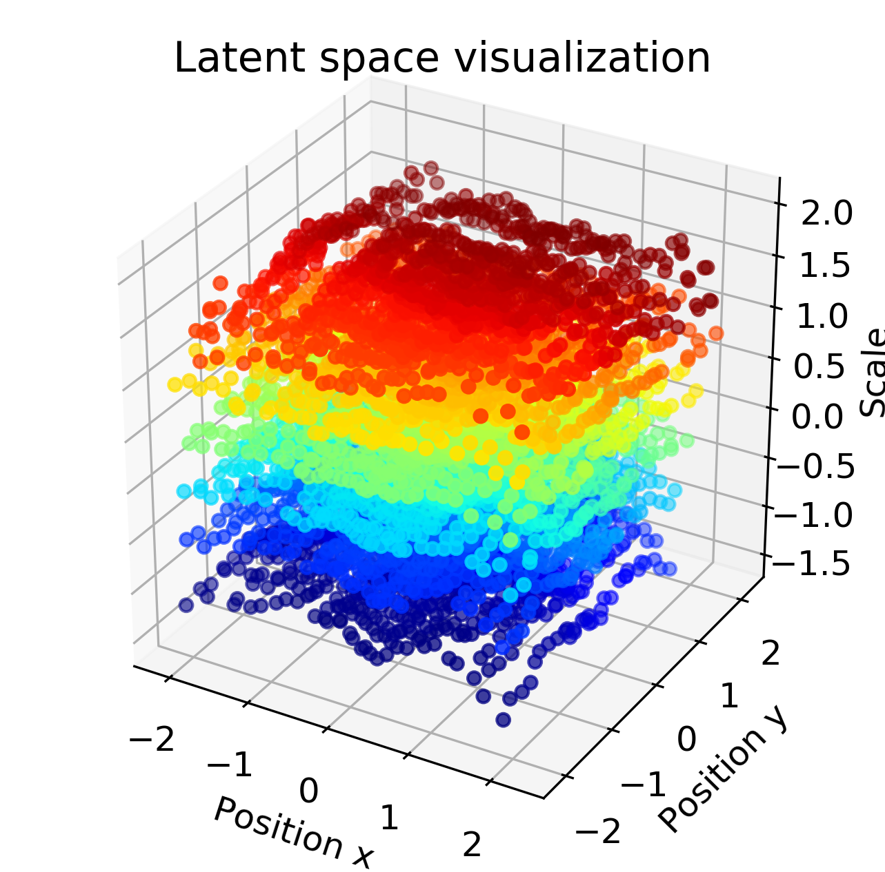 | 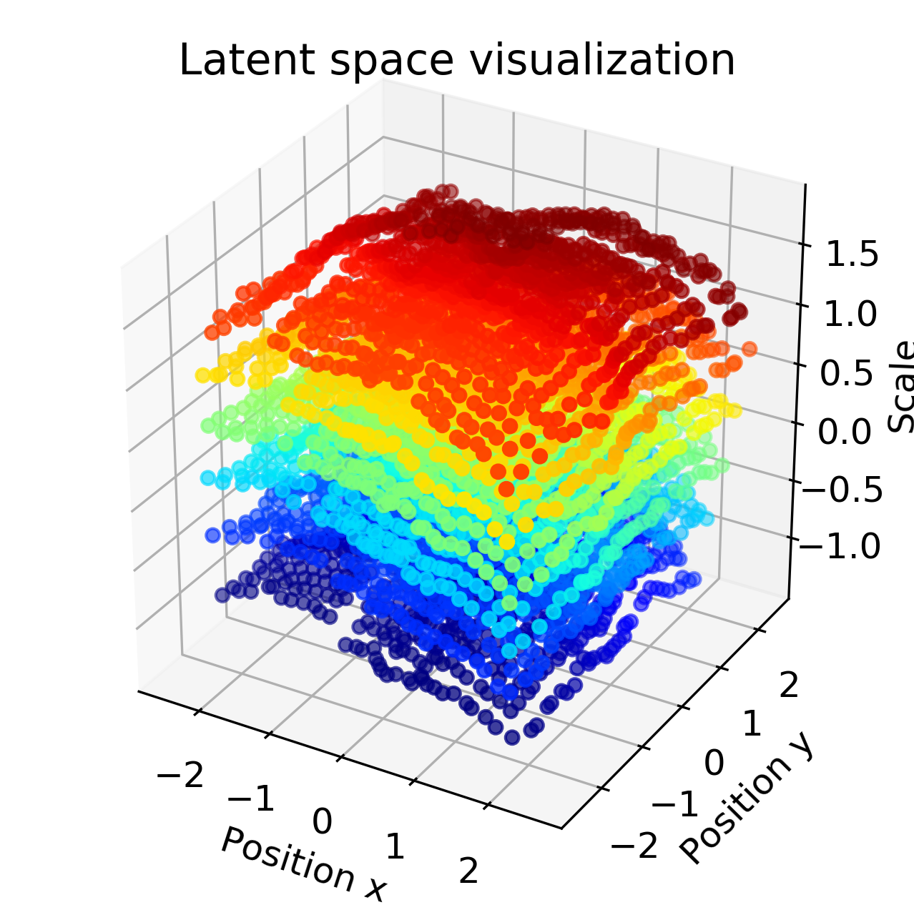 |

## Qualitative results
|Cars3d and Shapes3d| |
| :---: | :---: |
| Original | Groupified|
| 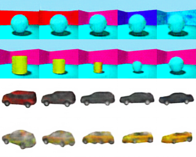 | 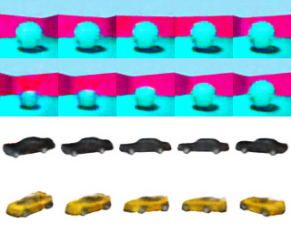 |

|Cyclic latent space| |
| :---: | :---: |
| Original | 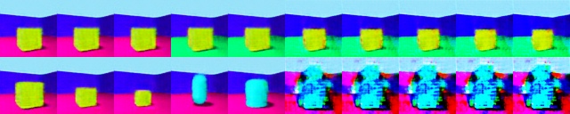 |
| Groupified | 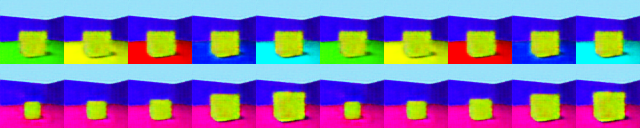 |


## Controllable meaningful dimensions in Groupified VAEs
| dSprites Anneal VAE| |
| :---: | :---: |
| KL divergence of dimensions | Traversal results |
| 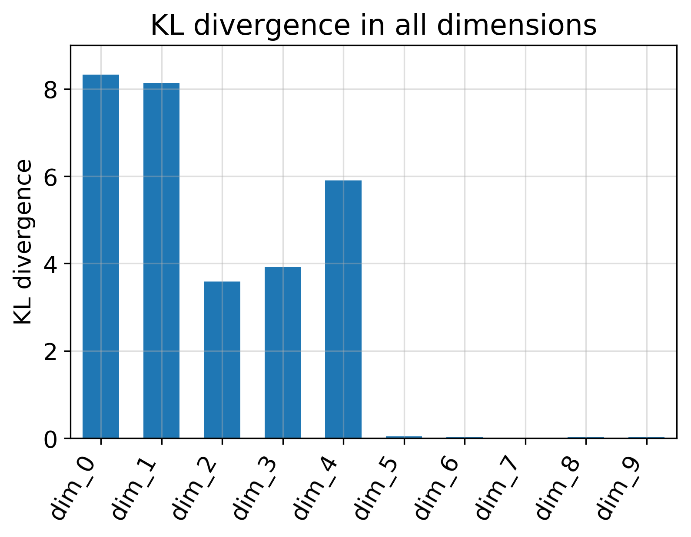 |  |

## Downstream Task Performance
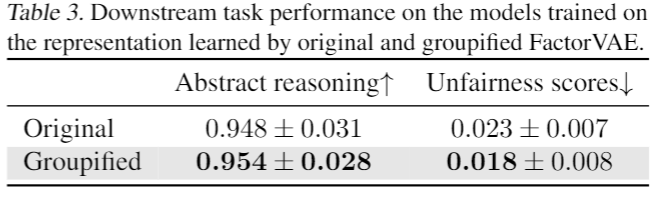


## BibTeX

```bibtex
@article{Tao2022groupified,
  title   = {TOWARDS BUILDING A GROUP-BASED UNSUPERVISED REPRESENTATION DISENTANGLEMENT FRAMEWORK},
  author  = {Tao, Yang and Xuanchi, Ren and Yuwang, Wang and Wenjun, Zeng and Nanning, Zheng and Pengju,Ren},
  journal = {ICLR},
  year    = {2022}
}
```